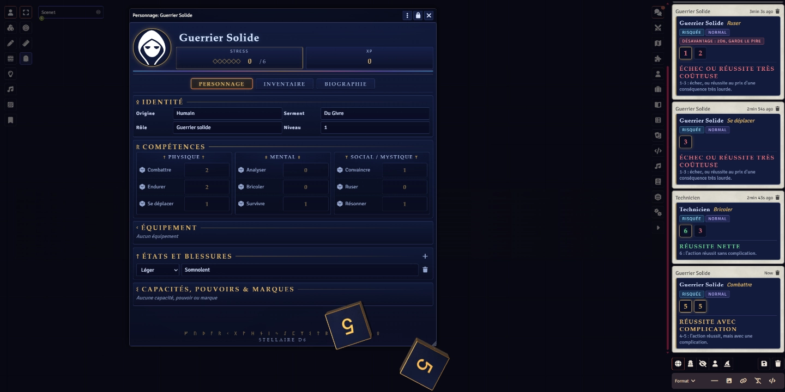

<p align="center">
  
</p>

# Stellaire D6 - Système Foundry VTT

Implémentation Foundry VTT du système **Stellaire D6**, permettant de jouer **La Croisade Stellaire** : un jeu de rôle de space opera mêlant exploration spatiale, aventure épique et mythologie nordique.

Ce projet vise à fournir une expérience intégrée dans Foundry VTT avec l'automatisation des mécaniques de jeu, la gestion des personnages et les outils nécessaires à la partie.

> **Note :** Les règles originales de référence (`regles-system-SD6.md`) sont privées et ne sont pas distribuées avec ce dépôt. Ce projet contient uniquement l'implémentation technique destinée à Foundry VTT.

## Installation

### Installation via Foundry VTT

1. Ouvrez votre instance de **Foundry Virtual Tabletop**.
2. Depuis l'écran d'accueil, sélectionnez **"Gestion des systèmes de jeu"**.
3. Cliquez sur **"Installer un système"**.
4. Dans le champ **"Manifeste du système"**, renseignez l'URL suivante :
```
https://github.com/Capsawk/stellaire-d6/releases/latest/download/system.json
```
5. Cliquez sur **"Installer"**.
6. Le système **Stellaire D6** apparaîtra dans votre liste de systèmes disponibles.

### Installation manuelle

Il est également possible d'installer le système manuellement :

1. Téléchargez la dernière release depuis GitHub.
2. Extrayez le dossier `stellaire-d6` dans votre répertoire : `FoundryVTT/Data/systems/`
3. Redémarrez Foundry VTT.
4. Le système sera disponible lors de la création d'une nouvelle partie.

## Compatibilité

- Foundry Virtual Tabletop : Version 14+


## Crédits

Ce système Foundry VTT est une implémentation technique du système **Stellaire D6**, basé sur les règles allégées créées par **Elostiragne**, et utilisé pour jouer **La Croisade Stellaire**, créée par **Bayross**.

### Système de règles

- **Elostiragne** — Créateur des règles allégées **Stellaire D6**
  - Chaîne Twitch : https://www.twitch.tv/elostiragne

### Univers

- **Bayross** — Créateur de **La Croisade Stellaire**

## Licence

Le code source du système est distribué sous licence MIT.

Les contenus de jeu (textes, illustrations, univers, marques et ressources associées)
restent la propriété de leurs auteurs respectifs et ne sont pas couverts par cette licence.

## Développement

L'avancement et les décisions de conception sont suivis dans [`ROADMAP.md`](docs/ROADMAP.md), l'historique des versions dans [`CHANGELOG.md`](CHANGELOG.md).

Ce projet utilise des outils d'assistance IA dans le processus de développement.
Toutes les modifications sont revues, testées et validées manuellement dans Foundry avant intégration.
